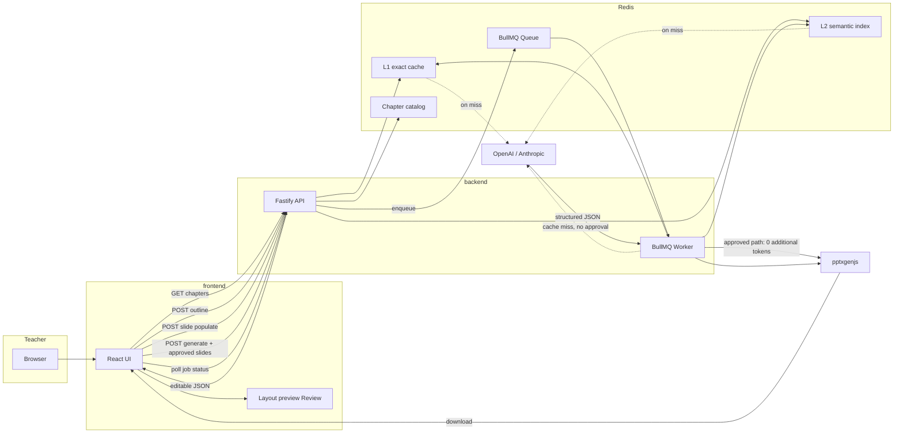
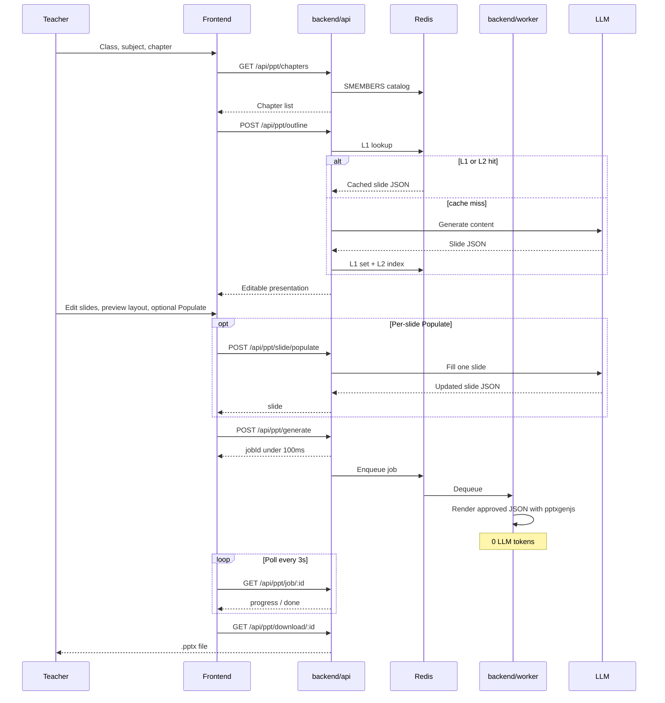
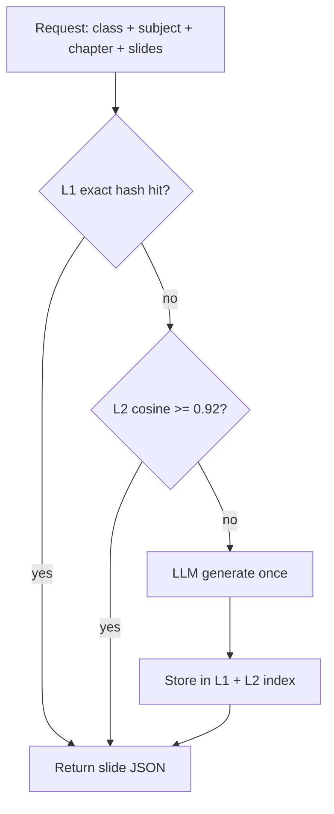
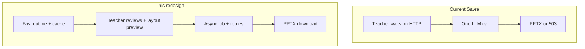

# System Architecture Diagram

Mermaid source for the Savra PPT generation redesign. Renders in GitHub, VS Code, and most markdown viewers.

## Outline-first async pipeline

## Request sequence (happy path)

## Cache layers

## Before vs after

